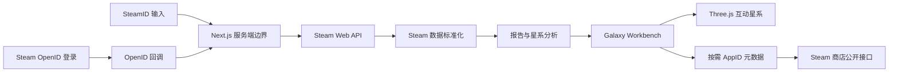

# 系统架构

- 状态：Accepted
- 版本：1.0
- 日期：2026-07-24
- 范围：Steam 游戏星系

## 1. 架构目标

建立一条短、可测试、不依赖数据库的链路：

1. 用户输入 SteamID，或通过 Steam OpenID 登录得到 SteamID。
2. Next.js 服务端读取 Steam 的公开资料与游戏库。
3. 纯函数分析层把原始数据转换为稳定的 `ReportData` 与星系模型。
4. React 在单页工作台中以 Three.js 呈现可探索的游戏星系。
5. 只有用户点选某颗星体时，客户端才按需读取该 AppID 的公开商店元数据。

不提前引入用户系统、任务队列、数据库或复杂微服务。完整游戏库不在服务端持久化，报告只保留在当前浏览器标签页。

## 2. 系统边界



浏览器不持有 Steam Web API Key，也不直接请求 Steam API。个人游戏库只经由同源报告接口读取；星体详情只能经由受限的同源 AppID 元数据接口读取。

## 3. 运行时组件

### 3.1 Landing

- 接受 SteamID64、自定义 ID 或 Steam 个人资料 URL。
- 提供“使用 Steam 登录”入口。
- 读取成功后把报告写入当前标签页，并进入 `/report`。
- 不在浏览器直接调用 Steam API。

### 3.2 Steam Gateway 与标准化

- 只访问硬编码的 Steam 主机、路径与接口。
- 校验第三方响应，把分钟数归一为整数，并将缺失字段显式转换为 `null` 或空集合。
- 将公开资料不可用、游戏库私密、超时、限流和异常响应映射为项目错误码。
- 不包含星体布局或 UI 规则。

### 3.3 Report 与 Galaxy Analyzer

- 按稳定规则计算累计时长、已游玩数量、Top 游戏与称号基础指标。
- 时长最高的 100 款生成独立 `GalaxyNode`；其余游戏生成一个长尾档案聚合。
- 体积按累计时长严格比例映射：1000 小时对应 100 小时的 10 倍体积。
- 未游玩游戏保留为弱档案信号，不伪装成发光行星。
- `galaxy-scene.ts` 只生成轨道、镜头焦点和绘制参数，不依赖 React 或 Three.js。

分析层必须是纯函数，保证接口响应、单元测试和客户端渲染使用同一份事实模型。

### 3.4 Galaxy Workbench

- `/report` 只渲染一个可持续探索的星系工作台，而非分页故事播放器。
- `StarMap` 用 Three.js 实例化绘制独立星体、长尾信号、轨道和环境粒子。
- 工作台在客户端按名称/AppID、点亮状态和累计时长过滤前 100 个独立星体；筛选不改变完整库存统计或长尾聚合。
- 支持拖动、缩放、点击，以及键盘调整视角和重置；聚焦星体时镜头平滑移动。
- 详情面板始终保留基础游戏信息、可访问名称和重置焦点入口。
- 尊重 `prefers-reduced-motion`，并在 WebGL 不可用时展示可读降级信息。

### 3.5 AppID Store Metadata

- `/api/steam/store/[appId]` 仅接受合法的公开 AppID。
- 服务端请求 Steam 商店公开接口，返回名称、封面、类型、系列与单人/多人模式等可公开字段。
- 元数据以 AppID 为键缓存；不缓存玩家 SteamID、游戏库或报告。
- 客户端按需发起请求，加载、不可用和重试状态都在详情面板中明确表达。

## 4. 路由状态

| 路径                       | 方法 | 职责                                         |
| -------------------------- | ---- | -------------------------------------------- |
| `/`                        | GET  | 接受 Steam 身份输入并准备游戏星系            |
| `/report`                  | GET  | 恢复当前标签页报告并打开游戏星系工作台       |
| `/api/steam/report`        | POST | 校验身份、读取 Steam 数据、返回 `ReportData` |
| `/api/steam/store/[appId]` | GET  | 按需返回可公开的 AppID 商店元数据            |
| `/api/auth/steam/start`    | GET  | 创建状态 Cookie 并跳转 Steam OpenID          |
| `/api/auth/steam/callback` | GET  | 验证 Steam 断言并签发一次性 SteamID Cookie   |
| `/api/auth/steam/consume`  | POST | 消费 SteamID Cookie 并返回既有 `ReportData`  |

`POST /api/steam/report` 使用 `Cache-Control: private, no-store`，不缓存玩家数据。`GET /api/steam/store/[appId]` 只缓存可公开的 AppID 元数据，并返回明确的 `Cache-Control` 时间窗口。

## 5. 目录边界

```text
app/
  page.tsx
  report/page.tsx
  api/
    steam/report/route.ts
    steam/store/[appId]/route.ts
    auth/steam/{start,callback,consume}/route.ts

components/
  landing/
  report/
    galaxy-workbench.tsx
    galaxy-workbench.module.css
    report-experience.tsx
    report-session.ts
    star-map.tsx

lib/
  steam/
    client.ts
    get-report.ts
    get-snapshot.ts
    openid.ts
    store-metadata.ts
  report/
    analyze.ts
    galaxy.ts
    galaxy-scene.ts
    metrics.ts
    titles.ts
    types.ts

tests/
  fixtures/
  unit/
```

依赖方向固定为：

```text
UI → report model + store metadata client
API route → steam gateway → normalizer → analyzer
galaxy scene → galaxy model
analyzer × React
analyzer × Next.js
```

其中 `×` 表示禁止依赖。

## 6. 两条用户链路

### 6.1 SteamID 输入

1. 用户提交 ID 或个人资料 URL。
2. 服务端解析为 SteamID64，并并行请求玩家资料与公开游戏库。
3. 标准化并分析数据，返回一次性 `ReportData`。
4. 客户端写入标签页会话并打开游戏星系。

### 6.2 Steam 登录

1. 服务端生成带短时效状态值的 OpenID 请求。
2. 用户在 Steam 页面完成登录。
3. 回调验证提供者响应和状态值，并从 Claimed ID 提取 SteamID64。
4. SteamID 写入两分钟 HttpOnly Cookie，由同源消费接口一次性读取。
5. 客户端获得同样的 `ReportData` 并进入游戏星系。

Steam 登录只证明 SteamID 的归属，不被视为访问私密游戏库的授权。

## 7. 状态、安全与性能

### 状态与缓存

- 不建立数据库，不保存玩家报告，不把完整 Steam 响应写入日志。
- `sessionStorage` 只支持当前标签页刷新恢复；不使用 `localStorage` 保存报告。
- OpenID 状态放在 10 分钟随机状态 Cookie 中；验证后的 SteamID 仅放在两分钟 HttpOnly Cookie 中。
- AppID 商店元数据不含个人信息，可使用服务端缓存；报告本身不可缓存。

### 安全边界

- `STEAM_WEB_API_KEY` 只存在于服务端环境变量。
- 所有输入和 AppID 都在外部请求前校验；外部主机与路径均为固定白名单。
- OpenID 回调必须验证 `check_authentication`、返回地址、状态值、签名字段和 Steam Provider。
- 日志不记录完整 SteamID、玩家昵称、完整游戏列表、OpenID 返回参数或 API Key。

### 性能预算

- 单独绘制上限为 100 个游戏；剩余库存聚合为长尾档案信号。
- 渲染使用实例化网格与共享纹理，避免为每颗星体创建独立 React 树。
- 商店元数据和封面仅在选中星体时请求；失败不得阻塞星系浏览。
- 移动端优先保证拖动、缩放、键盘选择和降级说明可用，避免横向溢出。

## 8. 错误模型

| 服务端错误码或客户端状态     | 用户提示方向                   | 是否可重试            |
| ---------------------------- | ------------------------------ | --------------------- |
| `INVALID_STEAM_ID`           | 没找到这个 Steam 用户          | 修改输入              |
| `PROFILE_UNAVAILABLE`        | 玩家资料暂时不可用             | 可以                  |
| `GAME_DETAILS_PRIVATE`       | 游戏详情未公开，并提供设置引导 | 修改 Steam 设置后重试 |
| `EMPTY_LIBRARY`              | 没有游戏可生成星系             | 通常不需要            |
| `STEAM_TIMEOUT`              | Steam 响应超时                 | 可以                  |
| `STEAM_RATE_LIMITED`         | 请求过于频繁                   | 稍后重试              |
| `STEAM_UNAUTHORIZED`         | API Key 无法完成请求           | 检查服务端配置        |
| `STEAM_BAD_RESPONSE`         | Steam 响应结构异常             | 可以                  |
| `CONFIGURATION_ERROR`        | 服务端缺少 API Key             | 配置后重试            |
| `OPENID_STATE_INVALID`       | 登录状态已过期                 | 重新发起 Steam 登录   |
| `OPENID_VERIFICATION_FAILED` | Steam 未确认登录断言           | 重新发起 Steam 登录   |
| `OPENID_TIMEOUT`             | Steam 登录验证超时             | 可以                  |
| 商店元数据不可用             | 保留游戏基础信息，提供重试     | 可以                  |
| `UNKNOWN_UPSTREAM_ERROR`     | Steam 暂时走丢了               | 可以                  |

前端不得通过“响应为空”猜测私密状态；Gateway 必须把可能的状态集中归一化。商店元数据失败不是游戏库读取失败，详情面板必须明确区分二者。
