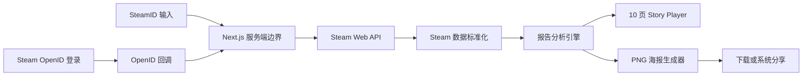

# 系统架构

- 状态：Accepted
- 版本：0.8
- 日期：2026-07-21
- 范围：MVP

## 1. 架构目标

建立一条尽可能短、可测试且不依赖数据库的生成链路：

1. 用户提供 SteamID，或通过 Steam OpenID 登录得到 SteamID。
2. Next.js 服务端读取 Steam 的公开资料与游戏库。
3. 纯函数分析层把原始数据转换为稳定的报告模型。
4. React 客户端播放 10 页故事。
5. 客户端使用相同分析模型在本地生成 PNG 海报。

这套架构首先服务个人作品集和低并发公开网站，不提前引入用户系统、任务队列、数据库或复杂微服务。

## 2. 系统边界



浏览器永远不直接持有 Steam Web API Key。所有 Steam 请求通过 Next.js Route Handler 发出。

## 3. 运行时组件

### 3.1 Landing

职责：

- 接受 SteamID64、自定义 ID 或 Steam 个人资料 URL。
- 提供“使用 Steam 登录”入口。
- 解释只支持公开的游戏详情。
- 不在浏览器中直接调用 Steam API。

### 3.2 Steam Identity Resolver

职责：

- 识别 SteamID64。
- 从受支持的 Steam 个人资料 URL 中提取标识符。
- 将自定义 ID 解析为 SteamID64。
- 拒绝任意外部 URL，避免把输入处理变成通用代理或 SSRF 入口。

### 3.3 Steam Gateway

职责：

- 集中管理 Steam API 的主机、路径、超时和 API Key。
- 获取玩家基本资料。
- 获取可见的游戏库与累计游玩时长。
- 把 Steam 错误转换为项目内部错误码。
- 不包含报告业务规则。

### 3.4 Normalizer

职责：

- 校验第三方响应结构。
- 将 Steam 的分钟数统一保留为整数分钟。
- 把缺失字段显式转换为 `null` 或默认空集合。
- 过滤无法用于报告的畸形条目，但保留诊断信息。

### 3.5 Report Analyzer

职责：

- 计算总时长、游戏数量、触达比例和集中度。
- 排序 Top 游戏。
- 识别未游玩和低时长游戏。
- 调用称号规则引擎。
- 产出与 React、Canvas、海报渲染均无关的报告模型。

分析层必须是纯函数。这是单元测试和复用海报数据的基础。

### 3.6 Title Engine

职责：

- 根据明确阈值匹配称号。
- 在多个规则同时满足时，根据优先级选择唯一主称号。
- 同时产出一句可解释原因。
- MVP 不读取游戏类型，也不调用大语言模型。

### 3.7 Star Layout Engine

职责：

- 根据累计时长计算星球面积。
- 生成确定性 circle-packing 坐标。
- 对大型库存设置可视节点上限并聚合长尾数据。
- 输出几何数据，不直接依赖 Canvas 或 SVG。

客户端星图 Canvas 和海报 Canvas 应复用同一份几何结果。

### 3.8 Story Player

职责：

- 每次只展示一个故事页面。
- 管理当前页、前后翻页、进度和方向键。
- 在移动端支持触控，但不依赖自动播放。
- 尊重 `prefers-reduced-motion`。
- 退出或刷新时允许从当前标签页的 `sessionStorage` 恢复一次报告。

实现状态：Phase 4 已接入。首页只在用户选择进入报告时写入 `ReportData`，写入成功后导航到 `/report`；损坏或版本不兼容的会话数据会被清理，缺失会话显示返回首页的恢复入口。

### 3.9 Poster Renderer

职责：

- 接收当前标签页中已经过验证的报告摘要，不额外提交玩家资料到海报接口。
- 使用客户端 Canvas 生成固定 1080 × 1440 PNG。
- 嵌入固定首页二维码，不在二维码中携带 SteamID。
- 在头像或游戏图标不可用时生成纯文字降级版。
- 提供下载；浏览器支持 Web Share Files 时提供系统分享。

## 4. 路由状态

Phase 2A 已实现与框架无关的 Steam 数据内核，Phase 2B 已将首页接入服务端接口，Phase 3 已把标准化快照转换为唯一 `ReportData`，Phase 4 已接通首页、标签页会话与十页 Story Player，Phase 5 已完成 Canvas 星图，Phase 6 已在末页接通本地 PNG 海报生成、下载和系统分享降级，Phase 7 已接通 Steam OpenID 与已有报告流程，Phase 8 已补齐错误文案、图片降级、海报重试与超长昵称保护。真实公开账号联调仍需配置 Steam API Key 与生产 `APP_ORIGIN`。

| 路径                       | 方法 | 状态           | 职责                                       |
| -------------------------- | ---- | -------------- | ------------------------------------------ |
| `/`                        | GET  | Phase 4 已接入 | 接受 Steam 身份输入并进入 Story Player     |
| `/report`                  | GET  | Phase 4 已接入 | 恢复标签页报告并播放十页故事               |
| `/api/steam/report`        | POST | Phase 3 已接入 | 校验身份、读取 Steam 数据、返回 ReportData |
| `/api/auth/steam/start`    | GET  | Phase 7 已接入 | 创建状态 Cookie 并跳转 Steam OpenID        |
| `/api/auth/steam/callback` | GET  | Phase 7 已接入 | 验证 Steam 断言并签发一次性 SteamID Cookie |
| `/api/auth/steam/consume`  | POST | Phase 7 已接入 | 消费 SteamID Cookie 并返回既有 ReportData  |
| `/api/poster`              | POST | 不设置         | 海报在客户端生成，无需传输玩家报告摘要     |

`POST /api/steam/report` 默认不缓存玩家数据，并返回明确的内部错误码，而不是把 Steam 原始错误直接暴露给前端。

## 5. 目录边界

顶层所有权边界已创建；Phase 2A 数据内核已经落地，其余业务文件仍按对应阶段逐步加入，不提前创建空实现。

```text
app/
  layout.tsx
  page.tsx
  globals.css
  report/page.tsx
  api/
    steam/report/route.ts    # Phase 2B-1 已实现
    auth/steam/start/route.ts
    auth/steam/callback/route.ts
    auth/steam/consume/route.ts

components/
  README.md
  landing/                  # Phase 2B-2 与 Phase 4 入口
  report/                   # Phase 4 已实现
    report-experience.tsx
    report-session.ts
    story-player.tsx
    story-player.module.css
    story-slides.tsx
    poster-generator.ts
  star-map/                 # Phase 5

lib/
  README.md
  steam/                    # Phase 2A 已实现
    client.ts
    resolve-id.ts
    schemas.ts
    errors.ts
    normalizers.ts
    get-snapshot.ts
    types.ts
  report/                   # Phase 3 已实现
    analyze.ts
    metrics.ts
    titles.ts
    types.ts
    poster.ts                # Phase 6

styles/
  README.md

tests/
  README.md
  fixtures/steam/           # Phase 2A 已实现
  unit/
    project-setup.test.ts
    steam-client.test.ts
    steam-resolve-id.test.ts
    steam-snapshot.test.ts
  e2e/                      # 后续阶段

tokens.css
```

依赖方向固定为：

```text
UI → report model
API route → steam gateway → normalizer → analyzer
poster → report model + star geometry
analyzer × React
analyzer × Next.js
```

其中 `×` 表示禁止依赖。

## 6. 两条用户链路

### 6.1 SteamID 输入

1. 用户提交 ID 或个人资料 URL。
2. 服务端解析为 SteamID64。
3. 并行请求玩家资料与公开游戏库。
4. 标准化并分析数据。
5. 返回一次性报告模型。
6. 客户端进入报告播放器。

### 6.2 Steam 登录

1. 服务端生成带短时效状态值的 OpenID 请求。
2. 用户在 Steam 页面完成登录。
3. 回调验证提供者响应和状态值。
4. 从 Claimed ID 中提取 SteamID64。
5. 将 SteamID 放入两分钟 HttpOnly Cookie，并由同源消费接口一次性读取。
6. 客户端获得与手动输入完全相同的 `ReportData`，进入报告播放器。

Steam 登录只证明 SteamID 的归属，不被视为访问私密游戏库的授权。

## 7. 状态与存储策略

### 服务端

- 不建立数据库。
- 不保存玩家报告。
- 不把完整 Steam 响应写入日志。
- OpenID 状态放在 10 分钟随机状态 Cookie 中；生产 HTTPS 发送 `HttpOnly`、`Secure`、`SameSite=Lax` 属性。
- 验证后的 SteamID 仅放在两分钟 HttpOnly Cookie 中，并由一次性消费接口立即删除。
- 玩家报告接口使用 `Cache-Control: private, no-store`。

### 客户端

- React 内存保存当前报告。
- 可用 `sessionStorage` 支持标签页内刷新恢复。
- 不使用 `localStorage` 长期保存玩家报告。
- 分享二维码只指向首页，其他用户不会看到原玩家的报告。

### 静态元数据

如果第二阶段加入游戏类型数据，只允许缓存不含个人信息的 AppID 元数据；这不改变玩家报告无持久化的原则。

## 8. 安全边界

- `STEAM_WEB_API_KEY` 仅存在于服务端环境变量。
- 所有用户输入在发起外部请求前进行长度、格式和字符集校验。
- 只请求硬编码的 Steam 主机和接口，不请求用户提供的任意 URL。
- 外部请求必须有超时、取消和统一错误映射。
- OpenID 回调必须验证 `check_authentication` 结果、返回地址、状态值、签名字段和 Steam Provider。
- 海报渲染器只使用当前报告推导出的 Steam 游戏图标 URL；头像或图标下载失败不会阻断生成。
- 日志不记录完整 SteamID；需要关联时使用请求级随机 ID。
- 公开部署后如出现滥用，优先使用部署平台限流或挑战机制，而不是为此引入数据库。

## 9. 错误模型

| 服务端错误码或客户端状态     | 用户提示方向                     | 是否可重试            |
| ---------------------------- | -------------------------------- | --------------------- |
| `INVALID_STEAM_ID`           | 没找到这个 Steam 用户            | 修改输入              |
| `PROFILE_UNAVAILABLE`        | 玩家资料暂时不可用               | 可以                  |
| `GAME_DETAILS_PRIVATE`       | 游戏详情未公开，并提供设置引导   | 修改 Steam 设置后重试 |
| `EMPTY_LIBRARY`              | 没有足够数据生成报告             | 通常不需要            |
| `STEAM_TIMEOUT`              | Steam 响应超时                   | 可以                  |
| `STEAM_RATE_LIMITED`         | 请求过于频繁                     | 稍后重试              |
| `STEAM_UNAUTHORIZED`         | API Key 无法完成请求             | 检查服务端配置        |
| `STEAM_BAD_RESPONSE`         | Steam 响应结构异常               | 可以                  |
| `CONFIGURATION_ERROR`        | 服务端缺少 API Key               | 配置后重试            |
| `OPENID_STATE_INVALID`       | 登录状态已过期                   | 重新发起 Steam 登录   |
| `OPENID_VERIFICATION_FAILED` | Steam 未确认登录断言             | 重新发起 Steam 登录   |
| `OPENID_TIMEOUT`             | Steam 登录验证超时               | 可以                  |
| 海报生成失败（客户端状态）   | 保留报告，并允许重试或下载降级版 | 可以                  |
| `UNKNOWN_UPSTREAM_ERROR`     | Steam 暂时走丢了                 | 可以                  |

前端不得通过“响应为空”猜测私密状态；Gateway 必须把可能的状态集中归一化。海报失败不属于 Steam API 错误码，由播放器在浏览器本地处理。

## 10. 性能预算

- 报告页首屏只加载当前和下一页所需资源。
- 星图移动端最多绘制 100 个独立节点。
- 游戏图标失败不得阻塞故事页面。
- 头像、海报外部图片或 Canvas 编码失败必须保留可读文本与重试/下载路径。
- 超长昵称必须允许页面换行；固定尺寸海报至多绘制两行并省略剩余文本。
- 页面切换只动画 `opacity` 和 `transform`。
- 报告交互目标为主流移动设备稳定响应，不以桌面特效为优先。
- 海报生成独立于浏览器 DOM 截图；跨域图片无法安全写入 Canvas 时会自动用文字或编号降级后重新生成。

## 11. 可观测性

允许记录：

- 随机请求 ID
- 路由名称
- Steam 请求耗时
- 游戏条目数量区间
- 内部错误码
- 应用版本

禁止记录：

- 完整 SteamID
- 玩家昵称和头像 URL
- 完整游戏列表
- OpenID 返回参数
- Steam API Key

## 12. 后续仍需决定

- 包管理器：已确定 pnpm 11.9.0。
- Node.js：已确定 22.17.0，仓库通过 `.node-version` 和 pnpm 配置统一版本。
- 部署平台：保持平台中立，实施前根据 OpenID 回调、Node Runtime 和图片生成支持确认。
- OpenID 2.0 库：当前以固定 Steam Provider 和 `check_authentication` 实现最小验证器；若未来支持其他 Provider，再评估引入库。
- 中文字体：确认自托管字体体积和授权后再锁定。
- 正式首页 URL：海报二维码需要稳定地址后才能定稿。
